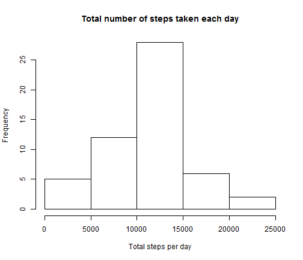
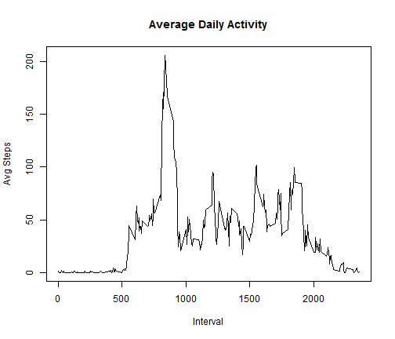
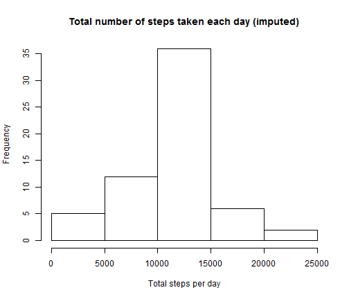
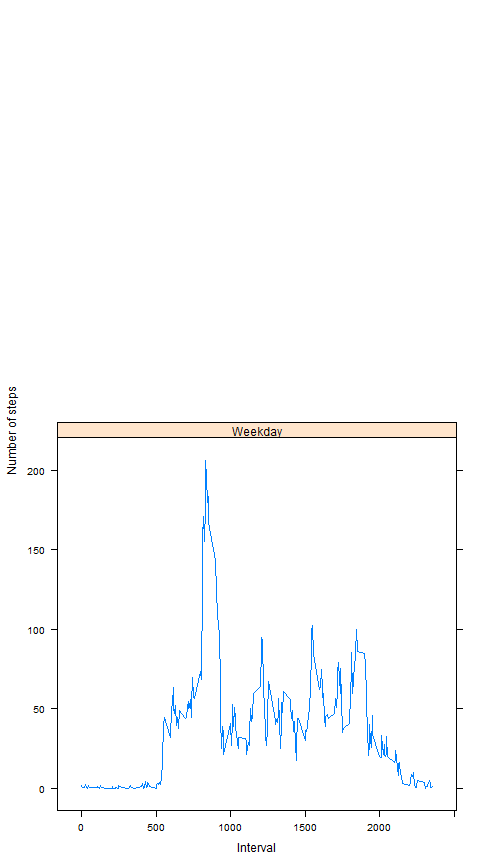

## Loading and preprocessing the data

```r
mydata <- read.csv(file="activity.csv", header=TRUE, sep=",")
```
## What is mean total number of steps taken per day?

```r
tot_steps_day <- aggregate(steps ~date, data=mydata, sum)
    hist(tot_steps_day$steps, xlab="Total steps per day", 
         main="Total number of steps taken each day")
```

 

```r
mean(tot_steps_day$steps)
```

```
## [1] 10766.19
```

```r
median(tot_steps_day$steps)
```

```
## [1] 10765
```

## What is the average daily activity pattern?

```r
tot_steps_interval <- aggregate(steps ~ interval, data=mydata, mean)

plot(tot_steps_interval$interval, tot_steps_interval$steps, 
    type="l", xlab="Interval", ylab="Avg Steps", main="Average Daily Activity")
```

 

```r
max_index <- which.max( tot_steps_interval[,2] )
tot_steps_interval[max_index,]
```

```
##     interval    steps
## 104      835 206.1698
```

```r
tot_steps_interval$interval[max_index]
```

```
## [1] 835
```


## Imputing missing values

```r
sum(is.na(mydata$steps))
```

```
## [1] 2304
```

```r
newdata <- mydata
sum(is.na(newdata$steps))
```

```
## [1] 2304
```

```r
for(i in 1:nrow(newdata)) {
  if (is.na(newdata$steps[i])) {
    idx_interval <- which(tot_steps_interval$interval == newdata$interval[i])
    newdata$steps[i] <- tot_steps_interval$steps[idx_interval]
  }

}

sum(is.na(newdata$steps))
```

```
## [1] 0
```

```r
new_tot_steps_day <- aggregate(steps ~date, data=newdata, sum)
    hist(new_tot_steps_day$steps, xlab="Total steps per day", 
         main="Total number of steps taken each day (imputed)")
```

 

```r
mean(new_tot_steps_day$steps)
```

```
## [1] 10766.19
```

```r
median(new_tot_steps_day$steps)
```

```
## [1] 10766.19
```

The mean and median are now the same.
Compared to the original data, the mean has stayed the same and the median increased by 1.

## Are there differences in activity patterns between weekdays and weekends?


```r
newdata$date <- as.Date(newdata$date)
newdata$weekday <- weekdays(newdata$date)
newdata$IsWeekend <- newdata$date %in% c('zondag','zaterdag')
newdata <- transform(newdata, IsWeekend = factor(IsWeekend))


newdata_means <- aggregate(steps ~ interval+IsWeekend, data=newdata, mean)

xyplot(steps ~ interval|IsWeekend, data=newdata_means, 
       strip = strip.custom(factor.levels = c("Weekday", "Weekend")),
       type="l", layout= c(1,2),xlab = "Interval", ylab = "Number of steps")
```

 


